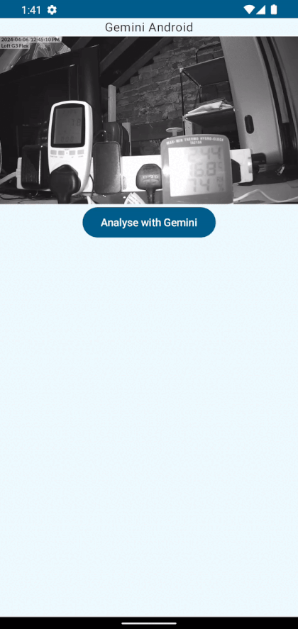
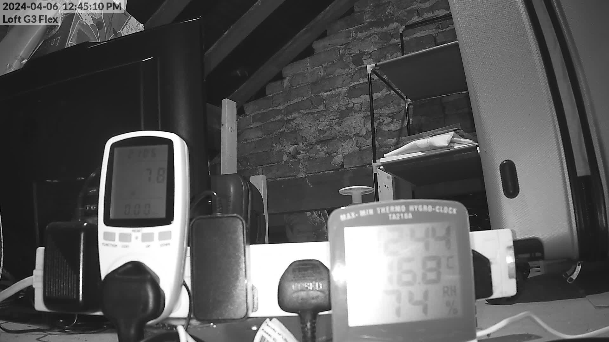

### OCR with Gemini LLM on Android

Tutorial here: https://blog.blundellapps.co.uk/ocr-with-gemini-llm-on-android/

The above gif is the Gemini Android Client SDK talking to the Gemini LLM and analysing the image below to read the text off the displays:

